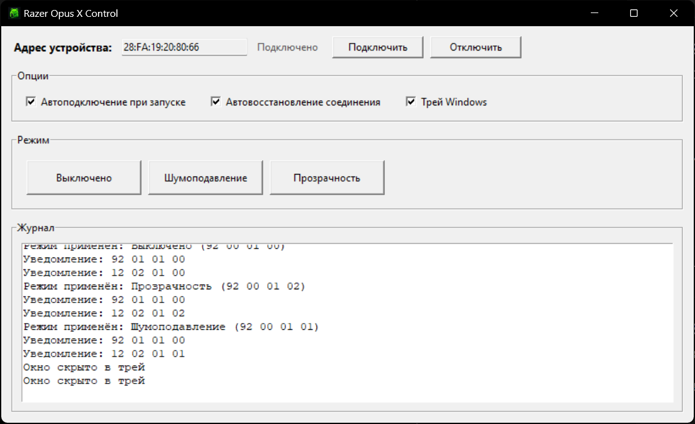

# Razer Opus X Control

Desktop application for controlling Razer Opus X audio modes over Bluetooth Low Energy (BLE).

Приложение для Windows, которое управляет режимами Razer Opus X через Bluetooth Low Energy (BLE).

## Key Features / Ключевые возможности

- BLE device discovery and automatic reconnect logic.
- Переподключение и мониторинг состояния BLE-соединения.
- Mode switching: `off`, `anc`, `transparency`.
- Переключение режимов: `Выключено`, `Шумоподавление`, `Прозрачность`.
- Optional Windows tray icon control.
- Опциональное управление через трей Windows.

## Screenshots / Скриншоты




## Requirements / Требования

- Windows 10 or Windows 11.
- Python 3.10+ (validated on Python 3.12).
- Bluetooth adapter enabled on PC.
- Compatible Razer device exposing expected BLE characteristics.

## Installation / Установка

```powershell
python -m venv .venv
.venv\Scripts\Activate.ps1
python -m pip install -r requirements.txt
```

## Usage / Запуск

```powershell
python main.py
```

- The app starts with auto-connect enabled by default.
- Приложение по умолчанию пытается подключиться автоматически.
- Tray mode is optional and can be toggled in the UI.
- Режим трея опционален и включается в интерфейсе.

## Build Windows EXE / Сборка Windows .exe

1. Install build dependencies:

```powershell
python -m pip install -r requirements-build.txt
```

2. Build one-folder executable:

```powershell
powershell -ExecutionPolicy Bypass -File .\scripts\build.ps1
```

3. Output executable:

- `dist\Razer Opus X Control\Razer Opus X Control.exe`

Optional: skip dependency installation inside the build script if your environment is already prepared:

```powershell
powershell -ExecutionPolicy Bypass -File .\scripts\build.ps1 -SkipDependencyInstall
```

## Project Structure / Структура проекта

```text
.
├── main.py                        # GUI + BLE runtime logic
├── razer.ico                      # Application icon
├── razer_opus_x_control.spec      # Canonical PyInstaller spec
├── requirements.txt               # Runtime dependencies
├── requirements-build.txt         # Build-only dependencies
├── scripts/
│   └── build.ps1                  # Reproducible Windows build script
└── README.md
```

## Known Limitations / Известные ограничения

- Designed for Windows BLE stack only.
- Требуется реальное BLE-устройство Razer для полной проверки функциональности.
- No persistent settings storage yet (preferences reset between launches).
- Сборка зависит от установленной среды Python и доступности зависимостей.

## Roadmap / Планы развития

- Add persistent settings (auto-connect, tray behavior, last known device).
- Добавить хранение пользовательских настроек.
- Add logging export and optional diagnostics panel.
- Добавить экспорт логов и диагностическую панель.
- Add CI workflow for lint/build checks on every push.
- Добавить CI-проверки сборки и качества кода.

